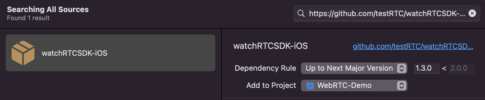

<p align="center">
  
</p>

# WatchRTC_SDK

This repository contains the WatchRTC_SDK iOS binaries.

The SDK is geared towards those who want to collect WebRTC related data from an iOS app, log and analyze it as part of the testRTC environment.

## Requirements
* iOS version >= 13.0

## Installation
### Swift Package Manager
1. Right click on your project’s name and choose “Add Packages”:\
    
2. On the new window that opened, paste the following url into the search bar on the right side: [https://github.com/testRTC/watchRTCSDK-iOS](https://github.com/testRTC/watchRTCSDK-iOS)
3. Set the “Dependency Rule” to `Up to Next Major` and specify the version you need:\
    
4. Click “Add Package”, wait for the installation to finish and click “Add Package” again.
5. The WatchRTC_SDK library is now added to your project.
It automatically appears in the left pane under “Package Dependencies”:\
    

### CocoaPods
Check out [Get Started](http://cocoapods.org/) tab on [cocoapods.org](http://cocoapods.org/).
To use WatchRTC_SDK in your project add the following line to your 'Podfile':
```ruby
pod 'WatchRTC_SDK'
```
Then, in Terminal, run:
```sh
pod install
```
In order to update the SDK to the newest version, in Terminal, run:
```sh
pod update WatchRTC_SDK
```

### Manual
1. Download the latest version of [`WatchRTC_SDK.xcframework`](https://github.com/testRTC/watchRTCSDK-iOS/tree/master/WatchRTC_SDK.xcframework). It can be done either by downloading a zip archive from the [tags](https://github.com/testRTC/watchRTCSDK-iOS/tags) page or by cloning this repository with a git client.
2. Open your Xcode project and click on project's name in "Project Navigator".
3. Click on your app target to open your target's "General" settings tab:\
    
4. Scroll down to the "Frameworks, Libraries, and Embedded Content" section.
5. Drag and drop `WatchRTC_SDK.xcframework` onto the "Frameworks, Libraries, and Embedded Content" section.
7. Ensure that "Embed & Sign" is selected:\
    

## Usage
### Import the framework
The below code should be added to the top of a source file of your application, where you would like to use the SDK.

```swift
import WatchRTC_SDK
```
### Implement the `RtcDataProvider` protocol
In order to provide statistics data to WatchRTC, your application should implement the `RtcDataProvider` protocol. The protocol should be implemented somewhere in your application where you have access to the WebRTC's `peerConnection` object.
```swift
extension WebRTCClient: RtcDataProvider {
    func getStats(callback: @escaping (RTCStatsReport) -> Void) {
        // get stats report from peerConnection (or another source if you are not using WebRTC directly)
        // and call callback(stats)
    }
}
```
### Initialize `WatchRTCConfig` with your API Key, room id and peer id
The `WatchRTCConfig` object must be initialized with your [API KEY](https://testrtc.com/docs/create-a-watchrtc-api-key/), [ROOM ID](https://testrtc.com/docs/rooms-and-peers-in-watchrtc/), and [PEER ID](https://testrtc.com/docs/rooms-and-peers-in-watchrtc/). The rest is optional.
```swift
let config = WatchRTCConfig(
    rtcApiKey: "<your_api_key>",
    rtcRoomId: "room_id",
    rtcPeerId: "peer_id",
    keys: "optional keys dictionary"
)
```
### Create `WatchRTC` object
```swift
// Optionally - pass config to the constructor
let watchRTC = WatchRTC(rtcDataProvider)
```
You must keep the `watchRTC` object in memory as long as you want to be connected to the testRTC's servers.

### If the config was not passed to the constructor, set it
```swift
watchRTC.setConfig(config)
```
### Connect to testRTC's servers
```swift
// Call connect() when a peer connection is active.
// The method can throw, so be sure to enclose it in do-try-catch statement.
do {
    try watchRtc?.connect()
} catch {
    debugPrint(error)
}
```
From this point, you can see your session on the WatchRTC dashboard.

### Disconnect from testRTC's servers
In order to close your connection to testRTC's servers, you need to call `disconnect()`
```swift
// Should be called once the WebRTC's peerConnection is closed.
watchRtc?.disconnect()
```

## Detailed API documentation
For the detailed API documentation [WatchRTC_SDK.doccarchive](Documentation/API&#32;Documentation/WatchRTC_SDK.doccarchive) (Can be opened with Xcode)

## Sample apps
For more details on how to use the SDK, see the 
* [WebRTC Sample app](https://github.com/testRTC/watchRTCSDK-iOS-SampleApp) - shows how to integrate WatchRTC SDK into applications working with WebRTC directly.
* [Twilio Sample app](https://github.com/testRTC/watchRTCSDK-iOS-TwilioSampleApp) - shows how to integrate WatchRTC SDK into applications working with Twilio SDK.
* [Vonage Sample app](https://github.com/testRTC/watchRTCSDK-iOS-VonageSampleApp) - shows how to integrate WatchRTC SDK into applications working with Vonage SDK (formerly TokBox OpenTok).
