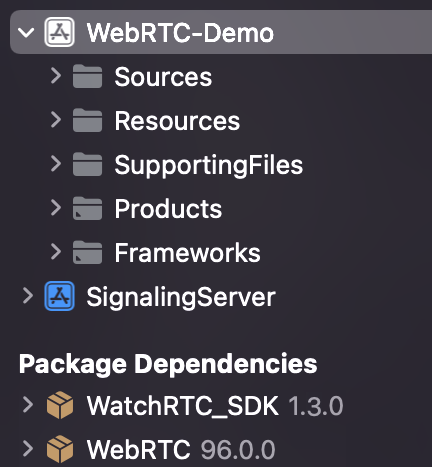

<p align="center">
  
</p>

# WatchRTC_SDK

This repository contains the WatchRTC_SDK iOS binaries.

The SDK is geared towards those who want to collect WebRTC related data from an iOS app, log and analyze it as part of the testRTC environment.

## Requirements
* iOS version >= 13.0

## Installation
### Swift Package Manager
1. Right click on your project’s name and choose “Add Packages”:\
    
2. On the new window that opened, paste the following url into the search bar on the right side: [https://github.com/testRTC/watchRTCSDK-iOS](https://github.com/testRTC/watchRTCSDK-iOS)
3. Set the “Dependency Rule” to `Up to Next Major` and specify the version you need:\
    
4. Click “Add Package”, wait for the installation to finish and click “Add Package” again.
5. The WatchRTC_SDK library is now added to your project.
It automatically appears in the left pane under “Package Dependencies”:\
    \

### CocoaPods
Check out Get Started tab on cocoapods.org.
To use WatchRTC_SDK in your project add the following line to your 'Podfile':
```ruby
pod 'WatchRTC_SDK'
```
Then, in Terminal, run:
```sh
pod install
```
In order to update the SDK to the newest version, in Terminal, run:
```sh
pod update WatchRTC_SDK
```


## Usage
### Import the framework
```swift
import WatchRTC_SDK
```
### Implement the `RtcDataProvider` protocol
```swift
extension WebRTCClient: RtcDataProvider {
    func getStats(callback: @escaping (RTCStatsReport) -> Void) {
        // get stats report and call callback(stats)
    }
}
```
### Initialize `WatchRTCConfig` with your API Key and room id
```swift
let config = WatchRTCConfig(
    "<your_api_key>",
    "room_id"
)
```
### Create `WatchRTC` object
```swift
// Optionally - pass config to the constructor
let watchRTC = WatchRTC(rtcDataProvider)
```
### If the config was not passed to the constructor, set it
```swift
watchRTC.setConfig(config)
```
### Connect to testRTC's servers
```swift
// Call connect() when a peer connection is active
watchRTC.connect()
```

## Detailed API documentation
For the detailed API documentation [WatchRTC_SDK.doccarchive](Documentation/API&#32;Documentation/WatchRTC_SDK.doccarchive) (Can be opened with XCode)

## Sample apps
For more details on how to use the SDK, see the 
* [WebRTC Sample app](https://github.com/testRTC/watchRTCSDK-iOS-SampleApp)
* [Vonage Sample app](https://github.com/testRTC/watchRTCSDK-iOS-VonageSampleApp)
